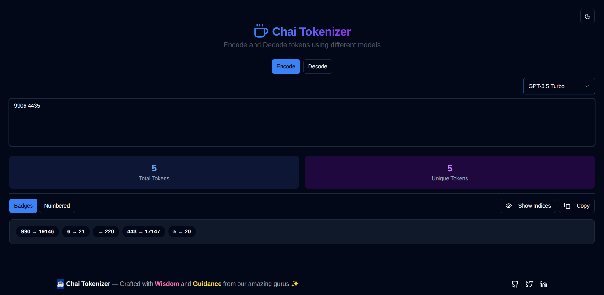
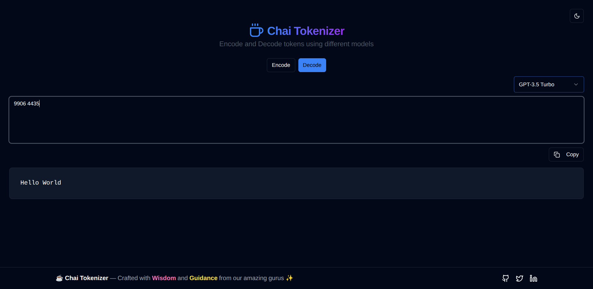

# Tokenizer

Tokenizer is a sleek web tool built with **React**, **TypeScript**, and **Tailwind CSS** for encoding and decoding text tokens using OpenAI's `tiktoken` library. It supports **multiple models** (like `gpt-3.5-turbo`, `gpt-4`) and allows you to **encode text → tokens** or **decode tokens → text**.

## 🚀 Features

- **Encode Mode**: Convert plain text into tokens (IDs) for the selected model.
- **Decode Mode**: Convert token IDs back into text.
- **Multiple Model Support**: Switch between OpenAI models easily.
- **Stats**: View total and unique token counts.
- **Copy Support**: Copy encoded token list or decoded text in one click.
- **UI Modes**: Display tokens as **badges** or **numbered list**.
- **Dark/Light Theme Toggle**.

## 📸 Screenshots

> Add your screenshots here  
> Example:  
> **Encode Mode**  
>   
> **Decode Mode**  
> 

## 🛠️ Tech Stack

- **React** (with TypeScript)
- **Tailwind CSS** + Shadcn UI components
- **Lucide React Icons**
- **js-tiktoken** for tokenization
- **Vite** (or Next.js if adapted)

## 📦 Installation

Clone the repository:

```bash
git clone https://github.com/sayandotdev/Tokenizer.git
cd -tokenizer
```

Install dependencies:

```bash
npm install
# or
yarn install
```

Run locally:

```bash
npm run dev
# or
yarn dev
```

## 📋 Usage

1. **Select Mode**:
   - **Encode**: Type your text in the textarea.
   - **Decode**: Enter token IDs separated by spaces or commas.
2. **Choose Model** from the model selector dropdown.
3. **View Output**:
   - In encode mode, tokens appear as badges or a numbered list.
   - In decode mode, the original text is displayed.
4. **Copy Results**: Click the **Copy** button to copy to clipboard.

### Example (Encode Mode)

Text: `"Hello world"`
Output:

```
Hello → 9906
world → 1917
```

### Example (Decode Mode)

Tokens: `9906 1917`
Output:

```
Hello world
```

## 📂 Project Structure

```
src/
  ├── components/
  │   ├── TokenizerCard.tsx     # Main encode/decode UI logic
  │   ├── ModelSelector.tsx     # Model dropdown component
  │   ├── Footer.tsx            # Footer UI
  │   └── ui/                   # Reusable UI components
  ├── App.tsx
  └── main.tsx
```

## ⚙️ Configuration

If using non-OpenAI models, adjust tokenization logic in:

```ts
if (model.startsWith("gpt")) {
  const enc = encodingForModel(model as TiktokenModel);
  ...
} else {
  // Placeholder logic for non-OpenAI models
}
```

## 📧 Contact

If you have questions, feel free to reach out:

- GitHub: [@/sayandotdev](https://github.com/sayandotdev)
- Website: [https://sayanrakshit.vercel.app](https://sayanrakshit.vercel.app)
